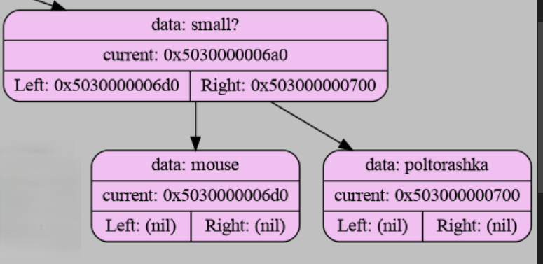

# AKINATOR
## Project Description
Akinator Game is a console implementation of the classic Akinator game in the C language. The program uses a binary tree to guess objects by asking questions with "yes" or "no" answers. If the program cannot guess the object, the user can add a new object and a question that distinguishes it. The project supports saving and loading the database, visualizing the tree using Graphviz, as well as logging for debugging.

The program was written on a WSL, but it is easily portable to Windows.

### Main features
- **The Akinator Game**: The program asks questions to guess the object that the user has guessed.
- **Adding new objects**: If the object is not guessed, the user can add it to the database by specifying a new question and answer.
- **Object Comparison**: The ability to compare two objects, showing their common and unique characteristics.
- **Visualization of the tree**: Generating a graphical representation of a decision tree using Graphviz.
- **Saving the database**: Saving the current state of the tree to a file when exiting.
- **Logging**: Detailed event logging (DEBUG, INFO, ERROR levels)

## DATABASE
- database example:
```
small?
    mouse
    poltorashka
```
- Should questions end with a symbol **?**
- Should the answers (leaves of the tree) not contain **?**
- Indentation (spaces or tabs) defines the structure of the tree.

Using Graphviz tree, the visualization of the tree looks like this:


## Building and running
if you do not have graphviz installed and you are running on linux or wsl, then type in the console:
```
sudo apt install graphviz
```
to compile the program, type in the console:
```
make build
```
to run the program, type in the console:
```
make run
```

## AUTHOR
The project is my implementation of the Akinator project in Ilya Dedinsky's course.
For all questions and suggestions, please contact:
- TG: https://t.me/atlaxsyys
-  email: y.shafran-06@mail.ru
- VK: https://vk.com/glupers

